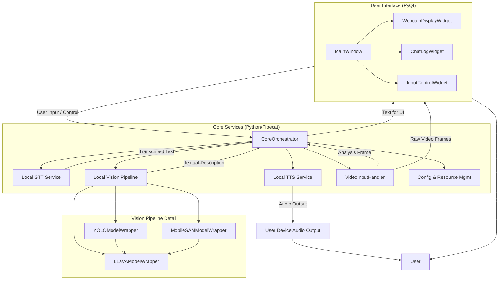
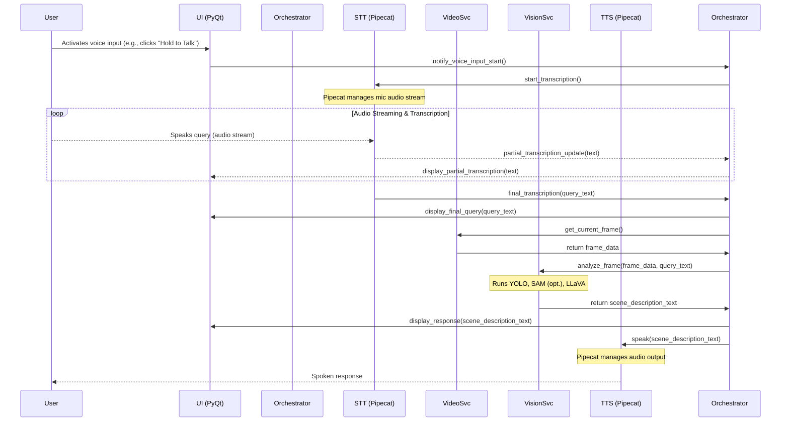
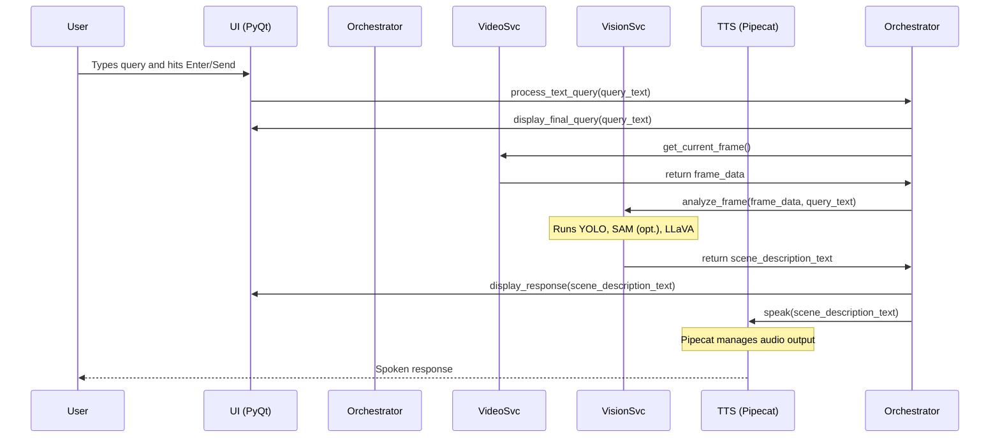

# Sourcer MVP Architecture Document

## Introduction / Preamble

This document outlines the overall project architecture for the Sourcer MVP, a locally-running AI webcam application. It covers the application's structure, core components, technology choices, and interaction patterns. Its primary goal is to serve as the guiding architectural blueprint for AI-driven development, ensuring consistency and adherence to chosen patterns and technologies.

**Relationship to Frontend Architecture:**
As Sourcer MVP is a desktop application with an integrated UI, this document will cover the UI architecture as part of the overall monolithic application structure. Specific UI component design and detailed user flows would typically be elaborated by a Design Architect, whose output would complement this document. Core technology stack choices documented herein (see "Definitive Tech Stack Selections") are definitive for the entire project.

## Table of Contents

  - Introduction / Preamble
  - Table of Contents
  - Technical Summary
  - High-Level Overview
  - Component View
      - Architectural / Design Patterns Adopted
  - Project Structure
      - Key Directory Descriptions
      - Notes
  - API Reference
      - External APIs Consumed (N/A for Core MVP Functionality)
      - Internal APIs Provided (Conceptual Internal Interfaces)
  - Data Models
      - Core Application Entities / Domain Objects
      - API Payload Schemas (Internal)
      - Database Schemas (N/A for MVP)
  - Core Workflow / Sequence Diagrams
      - Voice Query Workflow
      - Text Query Workflow
  - Definitive Tech Stack Selections
  - Infrastructure and Deployment Overview
  - Error Handling Strategy
  - Coding Standards
      - Detailed Language & Framework Conventions
          - Python Specifics
          - PyQt Specifics
  - Overall Testing Strategy
  - Security Best Practices
  - Key Reference Documents
  - Change Log
  - Prompt for Design Architect (UI/UX Specification Mode)

## Technical Summary

The Sourcer MVP is architected as a monolithic desktop application for Windows 10/11. It will be developed in Python, utilizing a monorepo structure. The core functionality involves capturing a webcam feed, processing user queries (voice or text) about the visual scene using local AI models (Ultralytics YOLO, MobileSAM, LLaVA for vision; local STT/TTS via Pipecat), and presenting responses both audibly and textually in a chat-like interface. Key architectural drivers include the mandatory local processing of all data and AI models, performance targets for interaction latency (\<3 seconds voice round-trip), and the need for a user-friendly installation package despite complex AI dependencies. The UI will be built using PyQt. The application is designed with modularity in mind to facilitate future enhancements.

## High-Level Overview

The Sourcer MVP follows a **monolithic architecture** deployed as a single desktop application. All components reside within a **monorepo** to simplify development and dependency management for the MVP.

The primary user interaction flow is as follows:

1.  The user launches the application, which displays a live webcam feed.
2.  The user initiates a query, either by voice (via microphone) or by typing into a text input field.
3.  For voice input, a local Speech-to-Text (STT) engine transcribes the audio.
4.  The transcribed or typed query triggers the local visual analysis pipeline. A frame from the webcam is captured and processed by a sequence of AI models (YOLO for object detection, MobileSAM for potential segmentation, LLaVA for visual language modeling and description generation).
5.  The generated textual description is displayed in the UI's chat/log area.
6.  The textual description is also sent to a local Text-to-Speech (TTS) engine, which verbalizes the response to the user.
7.  All processing occurs on the user's local machine, ensuring data privacy.

<!-- end list -->

```mermaid
graph TD
    User --> UI_VoiceInput[Voice Input (Microphone)];
    User --> UI_TextInput[Text Input];
    UI_VoiceInput --> STT[Local STT Service (Pipecat)];
    STT --> CoreOrchestrator[Core Orchestrator];
    UI_TextInput --> CoreOrchestrator;
    Webcam --> VideoInputHandler[Video Input Handler];
    VideoInputHandler -- Frame --> CoreOrchestrator;
    CoreOrchestrator -- Frame & Query --> VisionPipeline[Local Vision Pipeline (YOLO, SAM, LLaVA)];
    VisionPipeline -- Textual Description --> CoreOrchestrator;
    CoreOrchestrator -- Textual Description --> UI_ChatLog[UI Chat/Log Display];
    CoreOrchestrator -- Textual Description --> TTS[Local TTS Service (Pipecat)];
    TTS -- Spoken Response --> User;
    UI_ChatLog --> User;
    VideoInputHandler --> UI_WebcamDisplay[UI Webcam Display];
    UI_WebcamDisplay --> User;

    subgraph "Sourcer Desktop Application (Monolith)"
        UI_VoiceInput
        UI_TextInput
        UI_ChatLog
        UI_WebcamDisplay
        VideoInputHandler
        STT
        TTS
        CoreOrchestrator
        VisionPipeline
    end
```

## Component View

The application consists of several major logical components within the monolithic structure:

  - **User Interface (UI) Module (PyQt-based):**

      - **Responsibility:** Handles all user interactions, including displaying the webcam feed, chat/log history, text input fields, and microphone status indicators. It captures user input (voice commands, typed text) and presents output (textual and visual feedback).
      - Key Sub-components:
          - `MainWindow`: Main application window.
          - `WebcamDisplayWidget`: Renders the live webcam feed.
          - `ChatLogWidget`: Displays conversation history.
          - `InputControlWidget`: Manages text input and voice activation control.

  - **Video Input Handler Module:**

      - **Responsibility:** Accesses the default system webcam, captures video frames, and provides them to the UI for display and to the vision pipeline for analysis. Handles scenarios like webcam not found or access denied.

  - **Core Orchestrator Module (Python / Pipecat):**

      - **Responsibility:** The central nervous system of the application. It receives queries (transcribed voice or text), triggers the vision pipeline with the current webcam frame, receives the textual description, and coordinates sending it to the UI and the TTS service. Manages the overall flow of interaction. Pipecat will be instrumental in managing the STT and TTS pipeline segments.

  - **Local Vision Pipeline Module (Python):**

      - **Responsibility:** Performs the visual analysis. This module integrates and orchestrates the local AI models:
          - `YOLOModelWrapper`: For object detection from the webcam frame.
          - `MobileSAMModelWrapper`: For potential segmentation tasks to provide context or focus for LLaVA (use determined by LLaVA's needs and performance trade-offs).
          - `LLaVAModelWrapper`: For generating textual descriptions of the scene/objects based on the frame and potentially inputs from YOLO/SAM.
      - Ensures all model execution is local.

  - **Local STT Service (Integrated via Pipecat):**

      - **Responsibility:** Transcribes spoken user queries into text using a local STT engine. Pipecat will manage the audio input stream and interaction with the chosen STT engine.

  - **Local TTS Service (Integrated via Pipecat):**

      - **Responsibility:** Converts textual descriptions from the vision pipeline into spoken audio responses using a local TTS engine. Pipecat will manage sending text to the TTS engine and playing back the audio.

  - **Configuration & Resource Management Module:**

      - **Responsibility:** Manages application settings (though minimal for MVP), paths to AI models, and other necessary resources. Handles loading and initialization of AI models.

<!-- end list -->



### Architectural / Design Patterns Adopted

  - **Monolithic Application:** Chosen for MVP simplicity, reducing deployment and inter-service communication overhead.
  - **Model-View-Controller (MVC) or Model-View-Presenter (MVP) variants (Conceptual for UI):** The PyQt UI will be structured to separate display logic (View), user input handling (Controller/Presenter), and application data/state (Model, managed by the Core Orchestrator and other services).
  - **Service Orchestration (via Pipecat for Voice):** Pipecat will orchestrate the voice input (STT) and voice output (TTS) parts of the pipeline. The Core Orchestrator module will handle the broader application logic.
  - **Wrapper/Adapter Pattern:** Each AI model (YOLO, SAM, LLaVA, STT, TTS) will be wrapped in a dedicated Python class/module. This isolates the core application from the specifics of each model's API, making it easier to swap models or update versions.
  - **Event-Driven (Partially):** UI interactions (button clicks, voice activation) will trigger events that are handled by the application logic. Pipecat itself is event-driven for handling voice streams.
  - **Singleton (for Model Management):** AI models, being resource-intensive, will likely be loaded once and accessed via a singleton-like pattern or a dedicated resource manager to avoid redundant loading.

## Project Structure

```plaintext
sourcer-mvp/
├── .github/                    # CI/CD workflows (e.g., GitHub Actions)
│   └── workflows/
│       └── main.yml
├── .vscode/                    # VSCode settings (optional)
│   └── settings.json
├── assets/                     # Application assets (e.g., icons, model placeholders if not downloaded)
│   └── icons/
│       └── app_icon.png
├── config/                     # Configuration files (e.g., model paths, settings)
│   └── settings.ini
├── docs/                       # Project documentation (PRD, Arch, etc.)
│   ├── prd.md
│   └── architecture.md
├── models/                     # Placeholder for downloaded AI models (git-ignored, populated by script/user)
│   ├── stt/
│   ├── tts/
│   └── vision/
│       ├── yolo/
│       ├── sam/
│       └── llava/
├── scripts/                    # Utility scripts (model download, build, run helpers)
│   ├── download_models.py
│   └── run_dev.sh
├── src/                        # Application source code
│   ├── sourcer/                # Main application package
│   │   ├── __init__.py
│   │   ├── app.py              # Main application entry point (PyQt app initialization)
│   │   ├── core/               # Core logic, orchestration
│   │   │   ├── __init__.py
│   │   │   └── orchestrator.py
│   │   ├── services/           # Business services, wrappers for AI models, Pipecat integration
│   │   │   ├── __init__.py
│   │   │   ├── video_service.py
│   │   │   ├── vision_service.py # Wraps YOLO, SAM, LLaVA
│   │   │   ├── stt_service.py    # Integrates with Pipecat STT
│   │   │   └── tts_service.py    # Integrates with Pipecat TTS
│   │   ├── ui/                 # PyQt UI components
│   │   │   ├── __init__.py
│   │   │   ├── main_window.py
│   │   │   ├── widgets/
│   │   │   │   ├── __init__.py
│   │   │   │   ├── webcam_widget.py
│   │   │   │   └── chat_widget.py
│   │   │   └── resources.py      # For Qt resources if used (e.g., .qrc files)
│   │   ├── utils/              # Shared utility functions
│   │   │   ├── __init__.py
│   │   │   └── config_loader.py
│   │   └── main.py             # Script to launch the application
│   └── vendor/                 # Potentially vendored dependencies if not easily packaged
├── tests/                      # Automated tests
│   ├── unit/                   # Unit tests (mirroring src/sourcer structure)
│   │   ├── core/
│   │   │   └── test_orchestrator.py
│   │   └── services/
│   │       └── test_vision_service.py
│   └── integration/            # Integration tests (e.g., pipeline tests with mock models)
├── .env.example                # Example environment variables (if any specific needed)
├── .gitignore                  # Git ignore rules
├── requirements.txt            # Python dependencies for runtime
├── requirements-dev.txt        # Python dependencies for development (testing, linting)
├── pyproject.toml              # For Black, Flake8, MyPy, Pytest configuration
├── LICENSE                     # Project License
└── README.md                   # Project overview and setup instructions
```

### Key Directory Descriptions

  - **`assets/`**: Static application assets like icons.
  - **`config/`**: Static configuration files.
  - **`docs/`**: All project planning and reference documentation.
  - **`models/`**: Intended location for downloaded AI model files. This directory should be in `.gitignore`, and models should be downloaded via a script or as part of the setup/installation process.
  - **`scripts/`**: Utility scripts, e.g., for downloading models, running the application in development mode.
  - **`src/sourcer/`**: Main Python package containing all application source code.
      - **`app.py`**: Initializes and runs the PyQt application.
      - **`core/`**: Contains the central orchestration logic.
      - **`services/`**: Contains wrappers for AI models and integrations with Pipecat for STT/TTS.
      - **`ui/`**: Contains all PyQt based UI code, including main window and custom widgets.
      - **`utils/`**: Common utility functions.
      - **`main.py`**: Entry script to launch the application.
  - **`tests/`**: Automated tests, with `unit` tests mirroring the `src/sourcer` structure. `integration` tests for interactions between components.

### Notes

  - The `models/` directory structure is a suggestion; actual paths might depend on how the chosen AI libraries expect models to be laid out or how Pipecat is configured.
  - `requirements.txt` will list runtime dependencies, while `requirements-dev.txt` will include tools for development like `pytest`, `black`, `flake8`, `mypy`.
  - `pyproject.toml` will be used to configure `black`, `flake8`, `mypy`, and `pytest`.

## API Reference

### External APIs Consumed (N/A for Core MVP Functionality)

For the core MVP functionality, all processing is local, and no external APIs are consumed. Future enhancements might introduce them.

### Internal APIs Provided (Conceptual Internal Interfaces)

While not external APIs in the web sense, the modules within the application will interact through well-defined Python class/method interfaces:

  - **`CoreOrchestrator` Interface:**
      - `process_query(query_text: str, frame: FrameData) -> str`: Takes text query and frame, returns textual description.
      - `handle_voice_input(audio_chunk: bytes)`: Processes audio for STT.
      - `get_spoken_response(text: str) -> AudioData`: Converts text to speakable audio.
  - **`VideoService` Interface:**
      - `start_capture() -> bool`
      - `stop_capture()`
      - `get_current_frame() -> Optional[FrameData]`
      - `register_frame_callback(callback_fn)`
  - **`VisionService` Interface:**
      - `analyze_frame(frame: FrameData, query_context: Optional[str] = None) -> str`: Analyzes frame using YOLO, SAM (optional), LLaVA.
  - **`STTService (via Pipecat)` Interface:**
      - Conceptual: Pipecat provides services to stream audio and receive transcriptions. The `CoreOrchestrator` will use Pipecat's Python client library.
  - **`TTSService (via Pipecat)` Interface:**
      - Conceptual: Pipecat provides services to send text and receive/play audio. The `CoreOrchestrator` will use Pipecat's Python client library.

## Data Models

### Core Application Entities / Domain Objects

#### `FrameData`

  - **Description:** Represents a single video frame captured from the webcam.
  - **Schema / Interface Definition:**
    ```python
    from typing import NewType
    import numpy as np

    # Using numpy array for image data. Actual format (e.g., RGB, BGR)
    # will depend on webcam library and AI model input requirements.
    FrameData = NewType('FrameData', np.ndarray)
    ```
  - **Validation Rules:** Must be a valid image format usable by OpenCV (likely interfaced by the webcam library) and the vision models.

#### `Query`

  - **Description:** Represents a user's query to the system.
  - **Schema / Interface Definition:**
    ```python
    from dataclasses import dataclass
    from enum import Enum
    import time

    class QueryType(Enum):
        VOICE = "voice"
        TEXT = "text"

    @dataclass
    class Query:
        text: str          # The transcribed or typed query text
        type: QueryType    # Source of the query
        timestamp: float = time.time()   # Unix timestamp of query initiation
    ```

#### `SceneDescription`

  - **Description:** Represents the textual description of the visual scene generated by the AI.
  - **Schema / Interface Definition:**
    ```python
    from dataclasses import dataclass
    from typing import List, Dict, Any, Optional
    import time

    @dataclass
    class DetectedObject:
        label: str          # e.g., "cup", "book"
        confidence: float   # Confidence score from detector (0.0 to 1.0)
        bounding_box: List[int] # [x_min, y_min, x_max, y_max]

    @dataclass
    class SceneDescription:
        full_text: str             # Complete textual description from LLaVA
        objects: Optional[List[DetectedObject]] = None # Optional: Structured list of prominent objects
        timestamp: float = time.time()           # Unix timestamp of generation
        raw_model_outputs: Optional[Dict[str, Any]] = None # Optional: for debugging
    ```

### API Payload Schemas (Internal)

These refer to the data passed between internal components/services.

#### `VisionService.analyze_frame` Input:

  - `frame: FrameData`
  - `query_context: Optional[str]` (e.g., if the query provides specific focus)

#### `VisionService.analyze_frame` Output:

  - `description: str` (The textual description to be used by TTS and UI)

### Database Schemas (N/A for MVP)

No persistent database is required for the MVP's core functionality. Conversation history is session-based.

## Core Workflow / Sequence Diagrams

### Voice Query Workflow



### Text Query Workflow



## Definitive Tech Stack Selections

| Category             | Technology              | Version / Details          | Description / Purpose                                  | Justification (Optional)                                                                 |
| :------------------- | :---------------------- | :------------------------- | :----------------------------------------------------- | :--------------------------------------------------------------------------------------- |
| **Languages** | Python                  | 3.11.9                     | Primary language for application logic, AI, UI       | Mandated by project. Good for AI/ML, PyQt bindings.                         |
| **Runtime** | Python Runtime          | 3.11.9                     | Execution environment for Python code                  | Aligns with language choice.                                                             |
| **Frameworks** | PyQt6                   | 6.7.0 (example, use latest stable) | Desktop UI framework                                   | Good Python integration, mature, feature-rich for desktop UIs.                           |
|                      | Pipecat                 | Latest stable (e.g., 0.6.x) | Voice and multimodal AI pipeline orchestration       | Mandated for voice. Simplifies STT/TTS integration.                             |
| **AI Models** | Ultralytics YOLO        | Latest (e.g., YOLOv8 series) | Local object detection                                 | Mandated. State-of-the-art, good performance.                             |
|                      | MobileSAM               | Latest compatible          | Local image segmentation (context for LLaVA)         | Mandated. Lightweight SAM variant.                                        |
|                      | LLaVA                   | Latest compatible          | Local visual language model for descriptions         | Mandated. Good for generating textual scene descriptions.               |
|                      | Vosk (via Pipecat)      | Latest compatible STT model | Local Speech-to-Text engine                          | Good balance of local performance/accuracy for STT. Integrates with Pipecat.             |
|                      | Piper TTS (via Pipecat) | Latest compatible TTS model | Local Text-to-Speech engine                          | High-quality local TTS, efficient ONNX models. Integrates with Pipecat.                  |
| **UI Libraries** | PyQt6                   | 6.7.0 (example)            | Core UI components and layout                          | Chosen framework.                                                                        |
| **Testing** | Pytest                  | Latest stable (e.g., 8.x.x) | Unit/Integration testing framework                   | Popular, powerful, extensible Python testing framework.                                  |
|                      | pytest-mock             | Latest stable (e.g., 3.x.x) | Mocking library for Pytest                           | Simplifies mocking within Pytest.                                                        |
| **CI/CD** | GitHub Actions          | N/A                        | Continuous Integration/Deployment                      | Good integration with GitHub, flexible workflows for build/test/release.                 |
| **Packaging** | PyInstaller             | Latest stable (e.g., 6.x.x) | Bundles Python app into standalone executable        | Common choice for Python desktop apps, handles dependencies.                             |
|                      | Inno Setup              | Latest stable (e.g., 6.x.x) | Creates Windows installer package (EXE)              | Powerful and flexible for creating user-friendly Windows installers.                     |
| **Linters/Formatters**| Black                   | Latest stable (e.g., 24.x.x)| Python code formatter                                  | Uncompromising, ensures consistent code style.                                           |
|                      | Flake8                  | Latest stable (e.g., 7.x.x) | Python linter (PEP8, pyflakes, McCabe)               | Catches common errors and style issues.                                                  |
|                      | MyPy                    | Latest stable (e.g., 1.x.x) | Static type checker for Python                       | Enforces type safety, helps catch bugs early.                                            |
| **Other Tools** | OpenCV-Python           | Latest stable              | Computer vision library (for frame handling)         | Essential for image/video manipulation if needed by webcam or models.                  |
|                      | NumPy                   | Latest stable              | Numerical Python (for frame data arrays)             | Fundamental package for numerical computation, used for image data.                      |
|                      | PostHog                 | JS Snippet / Python lib    | User feedback and analytics                          | Specified in PRD for user feedback.                                               |

*Note: "Latest stable" implies the version available and stable at the time of development commencement. Specific minor/patch versions should be pinned in `requirements.txt`.*
*Preferred Starter Template Frontend/Backend: Not applicable, custom structure defined.*

## Infrastructure and Deployment Overview

  - **Cloud Provider(s):** Not applicable for MVP core functionality (local processing). GitHub for code hosting and releases.
  - **Core Services Used:** N/A for runtime. GitHub Releases for distributing the installer.
  - **Infrastructure as Code (IaC):** N/A.
  - **Deployment Strategy:**
      - Installer (`.exe`) built using `PyInstaller` and `Inno Setup`.
      - Distribution via GitHub Releases.
      - CI/CD using GitHub Actions:
          - On push/PR to `main`: Run linters, type checkers, unit tests.
          - On tag (e.g., `v0.1.0`): Build application with `PyInstaller`, create installer with `Inno Setup`, create GitHub Release, and upload installer.
  - **Environments:**
      - `Development`: Local developer machines.
      - `Release`: Packaged installer distributed to users.
  - **Environment Promotion:** N/A in the traditional sense. Promotion is from a successful `main` branch build to a tagged release.
  - **Rollback Strategy:** Users would need to uninstall the newer version and reinstall a previous version downloaded from GitHub Releases.

## Error Handling Strategy

  - **General Approach:** Use Python's standard exception handling (`try-except` blocks). Define custom exception classes inheriting from a base `SourcerException` for application-specific errors.
  - **Logging:**
      - Library/Method: Python's built-in `logging` module.
      - Format: Plain text with timestamp, log level, module name, and message. E.g., `YYYY-MM-DD HH:MM:SS - LEVEL - module_name - Message`. JSON format could be considered if advanced log analysis becomes necessary.
      - Levels:
          - `DEBUG`: Detailed information, typically of interest only when diagnosing problems.
          - `INFO`: Confirmation that things are working as expected (e.g., application start, model loaded).
          - `WARNING`: An indication that something unexpected happened, or an indication of some problem in the near future (e.g., 'disk space low'). The software is still working as expected.
          - `ERROR`: Due to a more serious problem, the software has not been able to perform some function (e.g., model failed to load, webcam access denied).
          - `CRITICAL`: A serious error, indicating that the program itself may be unable to continue running.
      - Context: Include function name, relevant parameters (sanitized if sensitive) where helpful for debugging. No PII in logs.
  - **Specific Handling Patterns:**
      - **AI Model Errors:** (e.g., model loading failure, inference error)
          - Log the detailed error.
          - Display a user-friendly message in the UI (e.g., "Visual analysis failed. Please try again.").
          - Gracefully degrade if possible (e.g., if one model in a chain fails, indicate partial results or failure).
      - **Webcam Errors:** (e.g., not found, access denied)
          - Log the error.
          - Display a clear message in the UI (e.g., "Webcam not detected or access denied. Please check your webcam settings.").
          - Disable functionality dependent on the webcam.
      - **Pipecat/STT/TTS Errors:**
          - Log errors from Pipecat services.
          - UI feedback (e.g., "Speech recognition failed," "Could not play audio response.").
      - **File/Resource Errors:** (e.g., config file not found)
          - Log the error.
          - Display a user-friendly message.
          - Application might fail to start if critical resources are missing.
      - **User Input Validation:** (Though minimal for MVP queries)
          - If text input has constraints in the future, validate and provide immediate feedback.
      - **Unhandled Exceptions:** Implement a global exception hook (e.g., `sys.excepthook`) to catch any unhandled exceptions, log them, and display a generic error message to the user ("An unexpected error occurred. Please restart Sourcer.") before attempting a graceful shutdown or exit.

## Coding Standards

These standards are mandatory for all code generation by AI agents and human developers.

  - **Primary Runtime(s):** Python 3.11.9
  - **Style Guide & Linter:**
      - Formatter: `Black` (default configuration). Run on save / pre-commit.
      - Linter: `Flake8` with plugins (`flake8-bugbear`, `flake8-comprehensions`, `flake8-print`). Configuration in `pyproject.toml` or `.flake8`.
      - Type Checker: `MyPy` (run in CI, strive for strictness). Configuration in `pyproject.toml`.
      - Linter rules are mandatory and must not be disabled without cause documented in comments.
  - **Naming Conventions:**
      - Variables: `snake_case`
      - Functions/Methods: `snake_case`
      - Classes/Types/Interfaces: `PascalCase`
      - Constants: `UPPER_SNAKE_CASE`
      - Files: `snake_case.py`
      - Modules/Packages: `snake_case`
  - **File Structure:** Adhere to the layout defined in the "Project Structure" section.
      - **Unit Test File Organization:** Unit tests will be located in the `tests/unit/` directory, mirroring the structure of the `src/sourcer/` package. For example, tests for `src/sourcer/core/orchestrator.py` will be in `tests/unit/core/test_orchestrator.py`.
      - **Unit Test File Naming Convention:** Test files will be named `test_*.py`. Test methods/functions within these files will be prefixed with `test_`.
  - **Asynchronous Operations:** While Pipecat handles async operations for voice, core application logic interacting with it should use appropriate async patterns if Pipecat's client library is async. For PyQt, ensure long-running tasks are offloaded from the main UI thread to prevent freezing (e.g., using `QThread` or `QtConcurrent`).
  - **Type Safety:**
      - All new Python code must include type hints.
      - `MyPy` will be used for static type checking, with `disallow_untyped_defs = True` as a goal.
      - *Type Definitions:* Co-located with usage or in dedicated `types.py` files within modules if complex/shared. Avoid `typing.Any` where specific types can be used.
  - **Comments & Documentation:**
      - Code Comments: Explain *why*, not *what*, for complex logic. Use Google Python Style Docstrings for modules, classes, functions, and methods.
      - READMEs: The main `README.md` will cover project setup and usage. Complex modules may have their own READMEs if necessary.
  - **Dependency Management:**
      - Tool: `pip` with `requirements.txt` (for runtime) and `requirements-dev.txt` (for development).
      - Policy: Pin exact versions (e.g., `library==1.2.3`) to ensure reproducible builds. Adding new dependencies requires a brief justification and check for existing alternatives or security vulnerabilities.

### Detailed Language & Framework Conventions

#### Python Specifics:

  - **Immutability:** Prefer immutable data structures where practical (e.g., tuples instead of lists for fixed collections). For classes, consider `@dataclass(frozen=True)` if appropriate. Be mindful of mutable default arguments in function definitions.
  - **Functional vs. OOP:** Employ classes for representing entities (data models), UI components (PyQt), and services with state or complex behavior. Use functions for stateless operations and utility tasks. List comprehensions and generator expressions are preferred over `map`/`filter` functions for readability when simple.
  - **Error Handling Specifics:** Always raise specific, custom exceptions inheriting from a base `SourcerException` (e.g., `ModelLoadError`, `VisionProcessingError`). Use `try-except-else-finally` blocks appropriately. Avoid broad `except Exception:` clauses without re-raising or specific, justified handling.
  - **Resource Management:** Always use `with` statements for resources that need to be managed (e.g., file operations, though less critical for this MVP's core). Pipecat and PyQt manage their own resources internally to a large extent.
  - **Type Hinting:** All new functions and methods must have full type hints. Run MyPy in CI. Aim for `disallow_untyped_defs = True` in `mypy.ini` or `pyproject.toml`.
  - **Logging Specifics:** Use the `logging` module. Configure a basic formatter providing timestamp, level, module, and message. Do not log sensitive PII. Use appropriate log levels.
  - **Code Generation Anti-Patterns to Avoid:** Avoid overly nested conditional logic (max 2-3 levels if possible, refactor otherwise). Avoid single-letter variable names unless for trivial loop counters (e.g., `i`, `j`, `k`) or conventional mathematical notation. Avoid "magic numbers"; use named constants.

#### PyQt Specifics:

  - **Threading:** Perform long-running operations (like AI model inference if it blocks, or complex I/O) in separate `QThread`s to keep the UI responsive. Use signals and slots for communication between threads and the main UI thread.
  - **Signal/Slot Mechanism:** Use Qt's signal and slot mechanism for communication between UI components and between UI and backend logic. This promotes loose coupling.
  - **UI Design:** While detailed UI design is for a Design Architect, ensure UI code is well-organized. Separate UI widget definitions from application logic where possible. Consider using Qt Designer (`.ui` files) and `uic.loadUi` for more complex UIs if preferred, or define UIs purely in Python. For MVP, Python-defined UI is likely sufficient.
  - **Resource Management:** PyQt objects (especially `QWidget` descendants) are often managed in a parent-child hierarchy. Ensure proper parenting to manage object lifetimes.
  - **Styling:** Use Qt Style Sheets for basic UI styling if needed, rather than hardcoding visual properties extensively.

## Overall Testing Strategy

  - **Tools:** `pytest` for test running and structure, `pytest-mock` for mocking.
  - **Unit Tests:**
      - **Scope:** Test individual functions, methods, and classes in isolation. Focus on business logic within orchestrator, service wrappers, utility functions, and individual UI component logic (if separable).
      - **Location:** `tests/unit/` mirroring `src/sourcer/` structure. E.g., `tests/unit/core/test_orchestrator.py`.
      - **Naming:** Test files `test_*.py`, test functions `test_*()`.
      - **Mocking/Stubbing:** Use `pytest-mock` (which wraps `unittest.mock`). Mock external dependencies such as Pipecat client calls, direct AI model library calls (if not fully wrapped by services), file system access, and time (if time-sensitive logic exists). For AI models, mock their `predict` or `process` methods to return predefined outputs.
      - **AI Agent Responsibility:** The AI Agent must generate unit tests covering all public methods of new/modified classes, significant logic paths, common input variations, edge cases, and error conditions.
  - **Integration Tests:**
      - **Scope:** Test the interaction between several components. E.g.:
          - `CoreOrchestrator` with mocked `VisionService`, `STTService`, `TTSService` to verify overall flow.
          - `VisionService` with mocked individual model wrappers (YOLO, SAM, LLaVA) to test their internal orchestration.
          - UI components with mocked backend services to test signal/slot connections and basic UI updates (might be limited without full UI automation).
      - **Location:** `tests/integration/`.
      - **Environment:** Run locally. Use mocked versions of heavy components like full AI models or Pipecat. Testcontainers are overkill for this local desktop app.
      - **AI Agent Responsibility:** May be tasked with generating integration tests for key interaction points between major services.
  - **End-to-End (E2E) Tests:**
      - **Scope:** Manual for MVP. Testers will follow scripts covering primary user flows: voice query for common object, text query, ensuring correct visual/audio/textual response within performance targets.
      - **Tools:** N/A for automated E2E in MVP.
      - **AI Agent Responsibility:** N/A for MVP automated E2E.
  - **Test Coverage:**
      - **Target:** Aim for \>80% line coverage for unit tests on critical business logic. Focus on test quality over raw numbers.
      - **Measurement:** `pytest-cov` plugin for `pytest` (generates coverage reports).
  - **Mocking/Stubbing Strategy (General):** Prefer focused mocks on direct dependencies. Avoid mocking transitive dependencies unless absolutely necessary. Strive for tests that are fast, reliable, and easy to understand.
  - **Test Data Management:** For unit/integration tests, define test data (e.g., sample frame data as numpy arrays, sample query strings, expected description texts) directly within test files or in small, co-located helper files/fixtures.
  - **CLI Testability:** Core processing elements should be testable via CLI. The `VisionService` (or its underlying model wrappers) should allow analysis of a saved image file via a simple script in `scripts/`. This aids debugging and component verification outside the full UI.

## Security Best Practices

  - **Input Sanitization/Validation:**
      - User typed input (queries): For MVP, queries are relatively free-form. Future features requiring structured input must validate it.
      - No external API calls means reduced attack surface from malicious external data.
      - File paths (e.g., for models in config): Validate paths to prevent directory traversal if paths become user-configurable. For MVP, these are likely fixed or internally derived.
  - **Output Encoding:**
      - Text displayed in PyQt UI: PyQt widgets generally handle text rendering safely. Avoid constructing HTML or rich text manually with unvalidated user/AI-generated content if such features were added.
      - Spoken output: TTS engines process plain text; risk of injection into the TTS voice itself is low with reputable local engines.
  - **Secrets Management:**
      - No external service API keys are needed for MVP core functionality.
      - If any future configuration requires secrets (e.g., optional analytics API key), they should not be hardcoded. Use environment variables or a secure config mechanism, and ensure they are not committed to the repository (e.g., via `.env` files listed in `.gitignore`).
  - **Dependency Security:**
      - Regularly update dependencies in `requirements.txt` and `requirements-dev.txt`.
      - Use tools like `pip-audit` or GitHub's Dependabot alerts to check for known vulnerabilities in dependencies. Address critical/high vulnerabilities promptly.
  - **Local Data Privacy:** The core design principle is local processing. Ensure no accidental data leakage:
      - Webcam feed, audio input, and generated descriptions must strictly remain on the local device.
      - Verify that none of the integrated libraries (Pipecat, AI models) make unauthorized network calls with user data. This can be checked during development with network monitoring tools.
  - **Code Integrity:**
      - Ensure model files downloaded are from official/trusted sources and ideally have checksums for verification if provided by the model distributors.
  - **Principle of Least Privilege (Application Context):**
      - The application should only request permissions it absolutely needs (e.g., webcam, microphone).
      - File system access should be limited to necessary directories (e.g., model storage, configuration).
  - **Error Handling & Information Disclosure:**
      - User-facing error messages should be generic and not reveal internal application structure, stack traces, or sensitive paths. Log detailed errors internally for debugging.
  - **Installation Package Security:**
      - Ensure the installer created by Inno Setup doesn't bundle unnecessary executables or create insecure system configurations.
      - If code signing becomes an option (post-MVP, as it involves costs/certificates), it would enhance trust.

## Key Reference Documents

  - Sourcer Product Requirements Document (PRD) (Typically `docs/prd.md` - User provided `uploaded:prd.txt`)
  - This Architecture Document (Typically `docs/architecture.md`)
  - Pipecat Documentation: [https://docs.pipecat.ai/](https://www.google.com/search?q=https://docs.pipecat.ai/)
  - Ultralytics YOLO Documentation: [https://docs.ultralytics.com/](https://docs.ultralytics.com/)
  - (Links to MobileSAM, LLaVA, PyQt, Vosk, Piper TTS documentation as primary references for developers)

## Change Log

| Change                                      | Date       | Version | Description              | Author        |
| :------------------------------------------ | :--------- | :------ | :----------------------- | :------------ |
| Initial Draft of Architecture Document      | 2025-05-17 | 0.1     | First comprehensive draft | 3-architect AI |
| Added Design Architect Prompt               | 2025-05-18 | 0.2     | Appended DA prompt       | 3-architect AI |

-----

## Prompt for Design Architect (UI/UX Specification Mode)

**Objective:** Elaborate on the UI/UX aspects of the Sourcer MVP, aligning with the established technical architecture (PyQt6 for UI) and the Product Requirements Document (PRD).

**Mode:** UI/UX Specification Mode

**Input Documents:**

1.  This complete Sourcer MVP Architecture Document (especially sections on UI components, technology choices, and overall workflow).
2.  The Sourcer Product Requirements Document (PRD) (content ID: `uploaded:prd.txt`), particularly the "User Interaction and Design Goals" and relevant user stories.

**Key Tasks for Design Architect:**

1.  **Review Inputs:** Thoroughly review this Architecture Document and the PRD to understand product goals, user stories, technical constraints (especially PyQt6 as the UI framework), and existing UI/UX guidelines.
2.  **Detailed User Flows:**
      * Collaboratively define and document detailed user flows for both voice-based and text-based queries, showing user steps and system responses within the PyQt6 application context.
      * Consider edge cases and error states in these flows (e.g., microphone not working, STT failure, vision analysis error, no objects detected).
3.  **Wireframes & Mockups (Conceptual for PyQt):**
      * Create conceptual wireframes for the main application window and its key components:
          * Webcam display area.
          * Chat/log area (for queries and responses).
          * Text input field and send/activate button.
          * Microphone activation control (e.g., "Hold to Talk" or "Click to Ask" button) and clear visual indicators of microphone status (idle, listening, processing).
      * Develop key screen mockups or detailed descriptions that translate these wireframes into a visual design aligned with the "clean, functional, and modern minimalist" aesthetic mentioned in the PRD. These should be feasible within PyQt6.
4.  **Interaction & Usability Specifications:**
      * Specify detailed interaction behaviors for all UI elements.
      * Define visual feedback mechanisms for system states (e.g., listening, processing query, analysis in progress, speaking response).
      * Detail how users will manage basic interactions (e.g., starting/stopping voice input, submitting text queries).
5.  **Accessibility Considerations (MVP Focus):**
      * Reiterate and expand on basic accessibility requirements from the PRD suitable for PyQt6:
          * Clear visual presentation of text; consider if text resizing is feasible.
          * Keyboard navigation for all interactive elements, especially text input and activation buttons.
          * Sufficient color contrast.
6.  **Output Document:**
      * Populate or create the `front-end-spec-tmpl.txt` document (or an equivalent UI/UX specification document) detailing all the above. This document should specifically reference PyQt6 as the implementation framework.
7.  **PRD Enrichment:**
      * Ensure that the PRD is updated or clearly references the detailed UI/UX specifications derived from your work, so that it provides a comprehensive foundation for subsequent development phases.

**Guidance:**

  * The UI framework is **PyQt6**, as defined in this Architecture Document. All UI/UX designs and specifications must be compatible with and leverage the capabilities of PyQt6.
  * The goal is to provide clear, actionable specifications that enable a developer (potentially an AI agent) to implement the UI in PyQt6 according to your design.
  * Collaborate with the user/stakeholder to refine these UI/UX details.