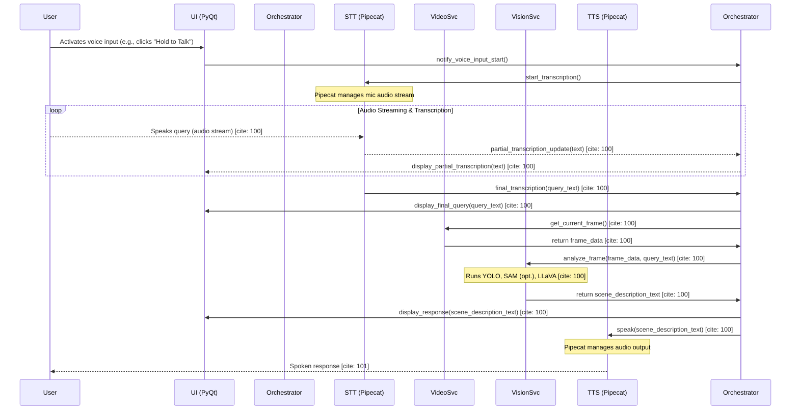
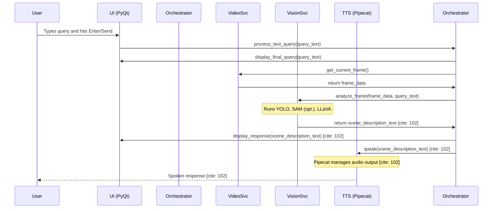

```markdown
# Core Workflow / Sequence Diagrams

> This document is a granulated shard from the main "Sourcer MVP Architecture Document" focusing on "Core Workflow / Sequence Diagrams".

### Voice Query Workflow [cite: 99]



### Text Query Workflow
